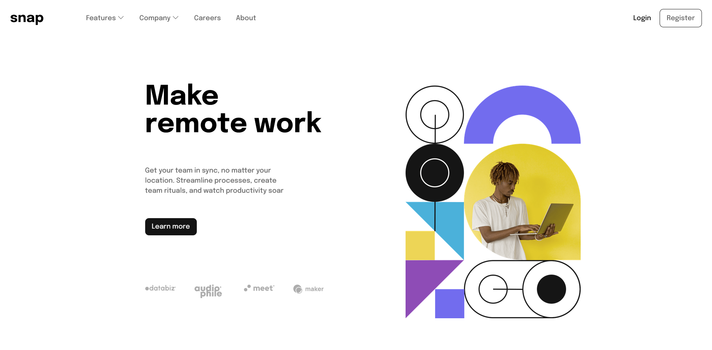

# Frontend Mentor - Intro section with dropdown navigation solution

This is a solution to the [Intro section with dropdown navigation challenge on Frontend Mentor](https://www.frontendmentor.io/challenges/intro-section-with-dropdown-navigation-ryaPetHE5). Frontend Mentor challenges help you improve your coding skills by building realistic projects. 

## Table of contents

- [Overview](#overview)
  - [The challenge](#the-challenge)
  - [Screenshot](#screenshot)
  - [Links](#links)
- [My process](#my-process)
  - [Built with](#built-with)
  - [What I learned](#what-i-learned)
  - [Continued development](#continued-development)
  - [Useful resources](#useful-resources)
- [Author](#author)

## Overview

### The challenge

Users should be able to:

- View the relevant dropdown menus on desktop and mobile when interacting with the navigation links
- View the optimal layout for the content depending on their device's screen size
- See hover states for all interactive elements on the page

### Screenshot




### Links

- Challenge URL: [Challenge URL](https://www.frontendmentor.io/challenges/intro-section-with-dropdown-navigation-ryaPetHE5)
- Live Site URL: [Live site url](https://agbortoko.github.io/intro-section-with-dropdown-navigation-main/)

## My process

### Built with

- Semantic HTML5 markup
- CSS custom properties
- Flexbox
- CSS Grid
- Mobile-first workflow
- Bootstrap icons for some icons
- Animate.css for simple animation


### What I learned

For this exercise, i learned how to handle image changes for different devices! Thought i faced quite a lot of 
difficulties with the navigation, both mobile and desktop

As you see below, at the header section of my website i have some classes that control the display of images depending on the user screen size

```html
  <div class="header_image">
            
            
  </div>
```

### Useful resources

- [W3schools how to section](https://www.w3schools.com/howto/default.asp) - I used the how to section to get ideas on how to arrange my navigation menu both on mobile and desktop

- [Bootstrap icons](https://icons.getbootstrap.com/) - I made use of the bootstrap icons for some icons, mainly the chevron in the mobile and desktop navigations

- [Animate css](https://animate.style/) - I used animate css to setup the simple slide animation on clicking the mobile menu


## Author

- Website - [Agbortoko Arreychuck](https://easythingz.net)
- Frontend Mentor - [@agbortoko](https://www.frontendmentor.io/profile/agbortoko)
- Twitter - [@agbortoko_arrey](https://www.twitter.com/agbortoko_arrey)

